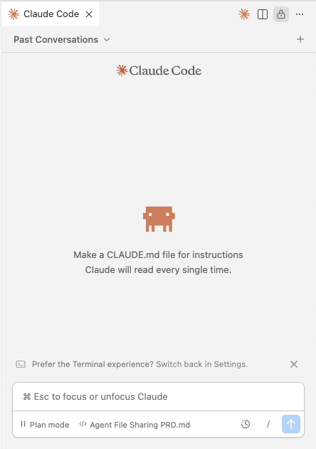

# ai-template-proj-bmad

Volg deze stappen om je brain-dump werkruimte in te richten. Dit is een template voor een project met AI-tools, voor de minder technisch onderlegde medewerkers.

## 1. Installeer VSCode

VSCode is een interessante editor voor markdown & code.

Open, download & install
https://code.visualstudio.com/


## 2. Installeer VSCode extenties

Hoe: 
https://code.visualstudio.com/docs/getstarted/extensions

Interessante extenties:
- Markdown All in One
- Markdown Preview Mermaid Support
- Claude Code for VS Code

## 3. Configureer Anthropic API key

Vraag een API key aan bij [assets.euri.com](https://assets.euri.com/)

Maak een environment variable aan voor de Anthropic API key

```bash
export ANTHROPIC_API_KEY="your-secret-key"
```

Hoe (windows):
https://phoenixnap.com/kb/windows-set-environment-variable

Hoe (macos):
https://phoenixnap.com/kb/set-environment-variable-mac

## 4. Start een BMAD brainstorm 

Volg de stappen om een brainstorm te starten

- open Claude Code plugin voor VSCode
   


- Start de `analyst`
```
/analyst

Ik ben gespecialiseerd in marktonderzoek, brainstormen, concurrentieanalyse, projectbriefs, en initiële projectontdekking. Als strategisch analist help ik je met onderzoek, ideeën ontwikkelen en actionable inzichten creëren.    
```

## 5. Optioneel installeer Obsidian
Obsidian is een note taking app gebaseerd op markdown

Open, download & install
https://obsidian.md/download

